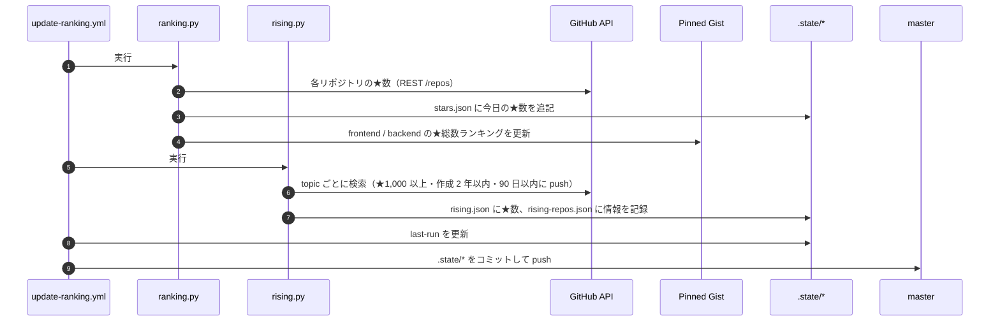

# データの流れ

どのバッチ（GitHub Actions の workflow）が、どのファイルを読み書きし、それが何に使われるかをまとめます。

## 全体図

```mermaid
flowchart LR
    config[("frameworks.json<br/>対象フレームワークと<br/>discover_topics")]

    subgraph daily["update-ranking.yml（毎日 JST 7:17）"]
        direction TB
        ranking["ranking.py<br/>★総数ランキング"]
        rising["rising.py<br/>Rising 候補の収集"]
        commit["Commit state<br/>（master に直接コミット）"]
        ranking --> rising --> commit
    end

    subgraph weekly["discover-frameworks.yml（毎週月曜 JST 7:37）"]
        discover["discover.py<br/>新規候補の検知"]
    end

    subgraph state[".state/（master にコミット・無制限に保持）"]
        stars[("stars.json<br/>掲載中フレームワークの<br/>日ごとの★数")]
        risingStars[("rising.json<br/>Rising 候補の<br/>日ごとの★数")]
        risingRepos[("rising-repos.json<br/>Rising 候補の情報<br/>言語・作成日・説明・topics・<br/>first_seen / last_seen")]
        lastRun[("last-run<br/>keepalive 用の日付")]
    end

    gists["Pinned Gist<br/>frontend / backend<br/>★総数ランキング"]
    issues["Issue<br/>framework-candidate"]
    future["今後: Rising ランキング・<br/>伸び幅の表示（未実装）"]

    config --> ranking
    config --> rising
    config --> discover

    ranking -->|"★数・言語"| gists
    ranking -->|"今日の★数を追記"| stars
    rising -->|"今日の★数を追記"| risingStars
    rising -->|"情報を追加・更新"| risingRepos
    commit -->|"日付を更新"| lastRun

    discover -->|"候補ごとに作成"| issues
    issues -.->|"人が採用を判断して追記"| config

    stars -.-> future
    risingStars -.-> future
    risingRepos -.-> future
```

- 実線: 現在動いている処理
- 点線: 人の作業、または今後の利用予定

## ファイルごとの役割

| ファイル | 書き込むもの | 中身 | 使い道 |
|---|---|---|---|
| `frameworks.json` | 人（手で編集） | カテゴリごとの対象リポジトリ、表示名、言語の上書き、検知用 topic | すべてのバッチの入力 |
| `.state/stars.json` | `ranking.py` | `{日付: {リポジトリ: ★数}}`（掲載中のフレームワーク） | 今後、伸び幅などを表示するときの過去データ |
| `.state/rising.json` | `rising.py` | `{日付: {リポジトリ: ★数}}`（Rising 候補） | 今後の Rising ランキング（伸びの大きい新しいリポジトリ）の元データ |
| `.state/rising-repos.json` | `rising.py` | `{リポジトリ: {言語, 作成日, 説明, topics, first_seen, last_seen, found_via}}` | Rising ランキングの表示・絞り込み用の情報 |
| `.state/last-run` | Commit state ステップ | 最終実行日（JST） | 60 日無活動で scheduled workflow が止まるのを防ぐ（keepalive） |

`.state/` のファイルは、毎日の workflow の最後に github-actions[bot] 名義で master に直接コミットされます（PR は通しません）。
記録はすべて無制限に保持します（`scripts/history.py` の `KEEP_DAYS`）。

## 毎日のバッチの処理順

★数の記録は Gist の更新より先に行うので、Gist の更新が失敗しても記録は残ります。
