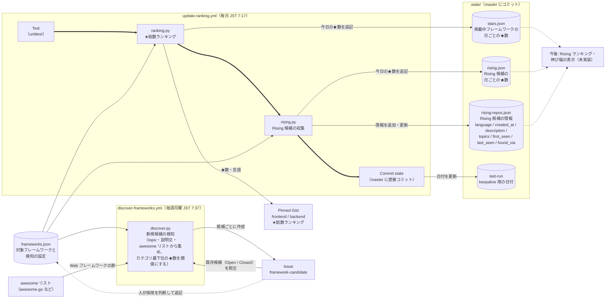
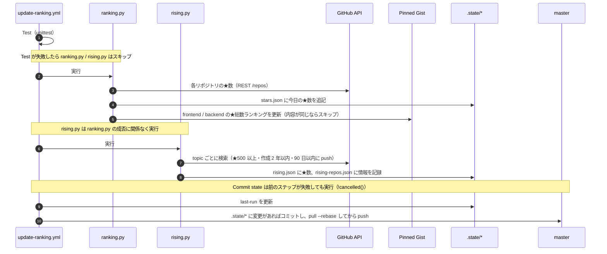

# データの流れ

どの workflow（とスクリプト）が、どのファイルを読み書きし、それが何に使われるかをまとめます。

## 全体図

- 太線（`update-ranking.yml` の中）: ステップの実行順。各ステップの実行条件は下の「毎日の workflow の処理順」を参照
- 実線: データの読み書き（現在動いている処理）
- 点線: 人の作業、または今後の利用予定

## ファイルごとの役割

| ファイル | 書き込み元 | 中身 | 使い道 |
|---|---|---|---|
| `frameworks.json` | 人（手で編集） | カテゴリごとの見出し（`title`）・Gist のファイル名（`filename`）・検知の設定（`discover_topics` / `discover_phrases` / `discover_awesome`）と、対象リポジトリ（`repo`・表示名 `name`・言語の上書き `language`） | すべての workflow の入力 |
| `.state/stars.json` | `ranking.py` | `{日付: {リポジトリ: ★数}}`（掲載中のフレームワーク） | 今後、伸び幅などを表示するときの過去データ |
| `.state/rising.json` | `rising.py` | `{日付: {リポジトリ: ★数}}`（Rising 候補） | 今後の Rising ランキング（伸びの大きい新しいリポジトリ）の元データ |
| `.state/rising-repos.json` | `rising.py` | `{リポジトリ: {language, created_at, description, topics, first_seen, last_seen, found_via}}` | Rising ランキングの表示・絞り込み用の情報 |
| `.state/last-run` | Commit state ステップ | 最終実行日（JST） | 60 日無活動で scheduled workflow が止まるのを防ぐ（keepalive） |

各ファイルの JSON 構成・項目の意味・例は [STATE_FORMAT.md](STATE_FORMAT.md) を参照してください。

`.state/` のファイルは、毎日の workflow の最後に github-actions[bot] 名義で master に直接コミットされます（PR は通しません）。
master にブランチ保護を設定するとこのコミットが失敗する点は [SETUP.md](SETUP.md) の「5. ★数の記録（自動）」を参照してください。

保持期間:
- 日ごとの★数（`stars.json` / `rising.json`）は無制限に保持します（`scripts/history.py` の `KEEP_DAYS = None`）。
  同じ日に複数回実行した場合は、その日最初の値を残します。
- `rising-repos.json` も項目を削除しません（見つかるたびに最新の情報に更新）。
- `last-run` は毎回上書きします。

## 毎日の workflow の処理順

`ranking.py` は Gist を更新する前に★数を記録し、Commit state ステップは前のステップが失敗しても実行されます。
そのため、Gist の更新が失敗しても（PAT の期限切れなど）、その日の★数の記録は master に残ります。
